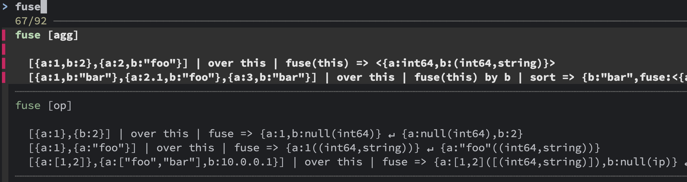

# SuperKit

The SuperKit library is a collection of common Functions and Operators for
[SuperDB](https://superdb.org/). These will also work with the last released
version of `zq` and `zed`, version 1.18.0.
                            
SuperKit also contains additional docs and descriptive tests as a supplement to
the official documentation.

https://github.com/chrismo/superkit/issues

## Installation

To install SuperKit, run the following command:

```sh
curl -fsS https://raw.githubusercontent.com/chrismo/superkit/main/install.sh | bash
```

This will install the SuperKit shell scripts (`sk`, `skdoc`, `skgrok`, `skops`)
into the XDG bin path, which is usually `~/.local/bin`, and the remaining files
into the XDG data path, which is usually `~/.local/share/superkit` if you
haven't redefined the XDG env vars. For more info, see the [XDG Base Directory
Specification](https://specifications.freedesktop.org/basedir-spec/basedir-spec-latest.html).
               
### sk

`sk` is a shell script that wraps `super` calls automatically including the
SuperKit library of funcs and ops, of which there are few currently, but
we're working on it. :) 

```shell
❯ sk -c '[1,20,300] | over this | sk_format_bytes(this*10000000)'  
"9 MB"
"190 MB"
"2 GB"
```

### skdoc

`skdoc` is a shell script that searches installed .md documentation for glob
matches of the search term (more options to come). This includes not only the
standard docs (`super` only at the moment, `zq` likely to be added in the
future), but supplemental SuperKit docs on a (small) variety of topics.

`skdoc` will look for a few recommended tools for viewing markdown files in your
terminal, starting with
[glow](https://github.com/charmbracelet/glow?tab=readme-ov-file#glow), then
falling back to
[bat](https://github.com/sharkdp/bat?tab=readme-ov-file#installation), and
finally checking the `PAGER` env var or using `less` if `PAGER` isn't set.
                                                                          
`glow` is preferred as it has great built-in features to browse, search, and
view the entire installed directory of documents.

Here's an example to show the SuperKit doc on Subqueries:

```shell
❯ skdoc subqueries
```

When an argument is passed to `skdoc`, the text is globbed with asterisks on
both sides, and opens the first file found with the preferred viewer (again,
`glow`, then `bat`, then `PAGER` if set, then `less`).

Running `skdoc` without any arguments will show the list of available docs in
various ways, depending on the installed markdown viewer.

```shell
❯ skdoc
```

If `glow` is installed, `glow` opens the root docs dir, and allows you to browse
and search all the docs from that root. Otherwise, if `fzf` is installed, then
all docs are listed in a `fzf` menu for selection, and the selected file will be
opened with the preferred reader (`bat`, `PAGER`, or `less`). Otherwise, without
`fzf`, all the .md files are listed in the terminal.

### skgrok
                                                         
`skgrok` is a small, focused tool, that allows you to search through the built-in
SuperDB grok patterns. It's best used with `fzf` for interactive searching, but
will also work with `less` or the `PAGER` env var set to another pager.

`skgrok` takes no arguments currently, and without `fzf` you can, of course,
pass the output to `grep` or other tools.
                
### skops

`skops` is a simple tool that lists a compact view of all the examples of funcs
and ops from both of the standard SuperDB docs and the SuperKit library. This is
useful as a quick reference and is best used with `fzf` installed to quickly
search through all examples as a reminder of how to use a particular func or op.
If `fzf` isn't present, the contents are paged out with `PAGER` or `less`.

If you have version 0.56.0 of `fzf` or later, `skops` will take advantage of its
multi-line support to show the examples in a more readable format.



`skops` takes no arguments currently, and without `fzf` you can, of course, pass
the output to `grep` or other tools.

# Developing SuperKit
   
## Repo Structure

Functions and ops can be in any number of different files, with test files
side-by-side.

The release process produces a single combined file that will be installed as a
single file to be included automatically by the `sk` script.
              
## Prefer using functions over operators

Operators cannot be executed in places required to be expressions, so if the
contents of the op or func can work as a func, make it a func.
                    
## Prefer referencing `this` instead of argument in operators

?? or the opposite?

## All custom funcs/ops start with `sk_`

There's nothing like namespacing in SuperDB, so we prefix all custom funcs/ops
this way. If we didn't do this, then more commonly named ones could possibly
collide with additions made in SuperDB itself in the future. Having some without
this prefix and some with would likely be confusing, and I'd rather avoid
wasting time deciding which items should get the prefix or not. It is a little
aesthetically unpleasing in some cases to have the prefix, but ¯\\_(ツ)\_/¯

## Multiple Versions

Especially with the supplemental documentation, there are variances between
`super` and `zq`, but the goal is to encapsulate these into one set of docs,
rather than versioning SuperKit separately for `super` and `zq`. In the future
we may need to do this, but for now, we'll try to keep it simple.

## Testing Installation Changes on a Branch

Use this command-line instead of the main installation script to test changes on
a branch:

```sh
curl -fsS https://raw.githubusercontent.com/chrismo/superkit/refs/heads/<branch-name>/install.sh |
  RELEASE=<pre-release-version> bash
```

## Release Process

### Prep Release

If it's a big enough release, or especially if it will have installation script
changes, make a new branch first to work on.

Once work is ready to be considered for release, fill out the changelog.jsup
record for the new release.

Do a fresh build! and then publish a new _pre_-release from the branch:

```shell
build  
./release.sh pre-release
```
                                 
If you have previous pre-releases, you may want to delete them manually in
GitHub.

To test this release, after util/launch-ubuntu.sh, install the pre-release with:

```shell
./install-sk.sh [branch name] [release version]
```
e.g.
```shell
./install-sk.sh rel 0.2.1-1f718a7
```
  
_NOTE: there is a download option for a Draft release, but the download link
involves a url path segment called "untagged-[sha]" and I dunno what the sha
represents, it doesn't match the sha in the tag. But this may be better than
testing from a published pre-release that then may get deleted later?_
          
### Make Release

Once the pre-release is tested and ready to go, we're ready to Do It Live.

- Merge the PR to main

- Update the install.sh script to default to the next version number (or do this
  on branch?)

- Commit and push to `main`.

- Re-run the build and release script.

```shell
build && ./release
```

Review the draft release, add the Full Changelog link to the release notes, then
publish the release.

### After Release

To prime changelog.jsup and the version string in the library, run this command.
This won't change the version in the install.sh script, we don't want that until
the next version is actually released.
                                      
```shell
./release bump_next_version
```
